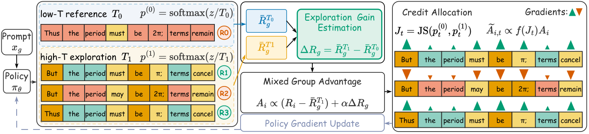
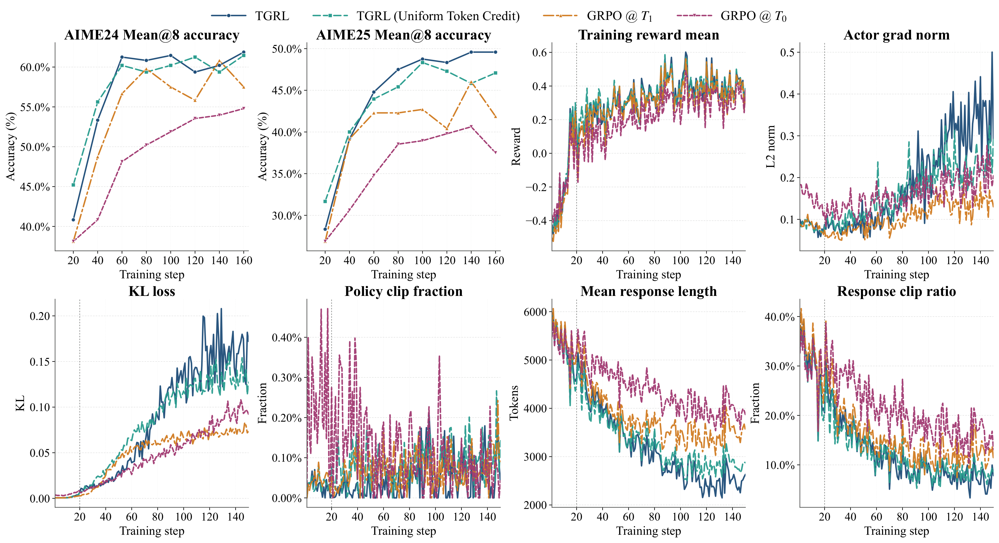

<div align="center">

# 🔥 TGRL

### Temperature-Grouped Reinforcement Learning for Efficient Exploration in LLMs

**Turn temperature-induced diversity into explicit, token-level training signal — without increasing the rollout budget.**

[](https://arxiv.org/abs/2609.33589)
[](https://neurips.cc/)
[](https://github.com/1229095296/TGRL)
[](https://www.python.org/)
[](https://github.com/volcengine/verl)

[Paper](https://arxiv.org/abs/2609.33589) · [PDF](https://arxiv.org/pdf/2609.33589) · [Code](https://github.com/1229095296/TGRL) · [Quick Start](#-quick-start) · [Citation](#-citation)

**Zihan Lin\*** · **Xiaohan Wang\*** · Jie Cao · Jiajun Chai · Wei Lin · Guojun Yin† · Ran He†  
<sub>\* Equal contribution · † Corresponding authors</sub>

University of Chinese Academy of Sciences · Meituan · MAIS & NLPR, Institute of Automation, Chinese Academy of Sciences

</div>

---

## 📰 News

- **2026-09-27** — TGRL was accepted as a **NeurIPS 2026 Poster**! 🎉
- **2026-09-27** — Paper and code released.

## TL;DR

Efficient exploration is a central bottleneck in reinforcement learning with verifiable rewards (RLVR). Simply increasing the sampling temperature can produce more diverse trajectories, but it does not tell the optimizer **whether** that exploration helped or **which tokens** deserve credit.

**TGRL** closes this loop in two stages:

1. **Mixed-temperature grouping** compares low-temperature reference rollouts with high-temperature exploratory rollouts and estimates a prompt-level exploration gain.
2. **JS-based token credit allocation** uses Jensen–Shannon divergence to assign more credit to positions whose next-token distributions are most sensitive to the temperature intervention.

The result is stronger and faster RLVR training under the **same rollout budget**.

> **Up to 36% faster** to equivalent accuracy · **+1.6 points** math average at 32B · **+196.7** CodeForces rating · **+4.4 points** LiveCodeBench Pass@16 · **+6.3 / +4.9 points** ALFWorld / WebShop success

## ✨ Highlights

- **Budget-preserving exploration.** TGRL reallocates a fixed rollout group into low- and high-temperature subsets rather than sampling more trajectories.
- **Reward-grounded exploration gain.** The subgroup reward gap directly measures whether broader exploration helps on each prompt.
- **Fine-grained credit assignment.** Token-level JS divergence highlights temperature-sensitive decision points instead of spreading a scalar advantage uniformly.
- **Broad empirical validation.** Evaluated on **11 benchmarks** spanning mathematical reasoning, code generation, and long-horizon agent tasks.
- **Scales across model sizes.** Experiments include Qwen3-4B/14B/32B and Qwen2.5-7B-Instruct.
- **Built on verl.** The repository provides distributed RLVR training with configurable rollout, optimization, and logging settings.

## 🧠 Method

<p align="center">
  
</p>
<p align="center"><em>Figure 1. TGRL estimates prompt-level exploration gain from low-/high-temperature reward contrast and allocates it to temperature-sensitive tokens through JS divergence.</em></p>

For every prompt, TGRL forms one temperature-contrastive rollout group. Low-temperature samples act as references, while high-temperature samples explore alternative reasoning trajectories under the same rollout budget.

### 1. Estimate prompt-level exploration gain

Let the low- and high-temperature reward means for prompt \(g\) be \(\bar R_g^{T_0}\) and \(\bar R_g^{T_1}\). TGRL estimates exploration gain as

$$
\Delta R_g = \bar R_g^{T_1} - \bar R_g^{T_0}.
$$

Under independent sampling, this is an unbiased estimate of the expected reward improvement caused by the temperature intervention. Normalizing rewards over the **mixed-temperature group** injects this contrast into the advantages of exploratory trajectories.

### 2. Locate temperature-sensitive tokens

For logits \(z_{i,t}\) at token position \(t\), TGRL computes two distributions from the same logits:

$$
p_{i,t}^{(0)}=\mathrm{softmax}(z_{i,t}/T_0), \qquad
p_{i,t}^{(1)}=\mathrm{softmax}(z_{i,t}/T_1),
$$

and measures their Jensen–Shannon divergence:

$$
J_{i,t}=\mathrm{JS}\!\left(p_{i,t}^{(0)},p_{i,t}^{(1)}\right).
$$

A larger \(J_{i,t}\) means that the token decision reacts more strongly to the temperature change. TGRL applies a monotone log compression and trajectory-wise normalization:

$$
\omega_{i,t}=\log\!\left(1+\frac{J_{i,t}+\epsilon}{\bar J_i+\epsilon}\right),
\qquad
w_{i,t}=\frac{\omega_{i,t}}{\bar\omega_i}.
$$

### 3. Optimize exploratory trajectories

The token-level advantage is

$$
\widetilde A_{i,t}=
\begin{cases}
0, & i\in\mathcal G_{g,T_0},\\
w_{i,t}A_i, & i\in\mathcal G_{g,T_1}.
\end{cases}
$$

Low-temperature samples establish the reference and contribute to group statistics; policy updates are applied to high-temperature exploratory trajectories. This asymmetry prevents a competing low-temperature update from weakening the exploration-gain correction.

## 📊 Main Results

All reported improvements below are taken from the paper. Math and code evaluations use 16 samples; agent results are averaged over three seeds.

### Mathematical reasoning

| Model | Method | AIME24 | AIME25 | AMC23 | MATH500 | Minerva | Olympiad | **Average** |
|---|---|---:|---:|---:|---:|---:|---:|---:|
| Qwen3-14B | Best non-TGRL baseline | 61.2 | 47.9 | **92.9** | 94.4 | **49.8** | 64.8 | 68.0 |
| Qwen3-14B | **TGRL** | **63.4** | **49.4** | 92.7 | **95.3** | 48.9 | **66.4** | **69.4** |
| Qwen3-32B | Best non-TGRL baseline | 61.6 | 51.2 | 91.3 | 94.6 | 49.8 | 65.7 | 68.6 |
| Qwen3-32B | **TGRL** | **62.3** | **51.6** | **91.4** | **95.2** | **50.6** | **69.9** | **70.2** |

TGRL achieves the best six-benchmark average at both scales, outperforming the strongest baseline by **1.4 points at 14B** and **1.6 points at 32B**.

### Code generation — Qwen3-4B

| Method | LiveCodeBench Avg@16 | LiveCodeBench Pass@16 | CodeForces Rating | CodeForces Percentile | HumanEval+ Pass@16 |
|---|---:|---:|---:|---:|---:|
| Best non-TGRL result | 43.2 | 57.7 | 1377.6 | 71.9 | **97.5** |
| **TGRL** | **43.6** | **62.1** | **1574.3** | **84.3** | 96.9 |

TGRL raises the best prior **CodeForces rating by 196.7 points** and improves **LiveCodeBench Pass@16 by 4.4 points**.

### Long-horizon agents — Qwen2.5-7B-Instruct

| Method | ALFWorld Success | WebShop Task Score | WebShop Success |
|---|---:|---:|---:|
| Best non-TGRL RL baseline | 80.4 | 81.4 | 69.3 |
| **TGRL** | **86.7** | **85.7** | **74.2** |

The largest ALFWorld sub-task gain appears on **Pick2**, where TGRL reaches **95.0%**, compared with **68.8%** for PPO.

### Training dynamics

<p align="center">
  
</p>
<p align="center"><em>Figure 2. Training dynamics on Qwen3-14B. TGRL achieves stronger downstream accuracy with shorter responses and less truncation than fixed-temperature GRPO variants.</em></p>

On the Qwen3-14B run, TGRL also shows more efficient generation dynamics:

| Method | Late-stage response length | Response clipping ratio |
|---|---:|---:|
| GRPO @ low temperature | 3915 | 16.0% |
| GRPO @ high temperature | 3482 | 12.4% |
| **TGRL** | **2476** | **7.2%** |

TGRL reaches equivalent accuracy **up to 36% faster** than strong RLVR baselines without increasing the rollout budget.

## 🚀 Quick Start

### 1. Clone the repository

```bash
git clone https://github.com/1229095296/TGRL.git
cd TGRL
```

### 2. Create the environment

Python **3.10 or later** is required. A CUDA-capable distributed training environment is recommended.

```bash
conda create -n tgrl python=3.10 -y
conda activate tgrl

pip install -r requirements.txt
# Install a rollout backend compatible with your CUDA/PyTorch stack.
# The repository includes helper scripts and separate SGLang requirements.
pip install -e .
```

> [!NOTE]
> `flash-attn`, PyTorch, vLLM/SGLang, and distributed-training dependencies are sensitive to CUDA and driver versions. Follow the installation guidance for your hardware stack before launching a full run. `scripts/install_vllm_sglang_mcore.sh` is included as a reference helper.

### 3. Prepare model and data

The default training entry point expects local model and Parquet dataset paths. The paper uses:

| Domain | Backbone | Training data |
|---|---|---|
| Mathematics | Qwen3-4B/14B/32B | DeepScaleR |
| Code | Qwen3-4B | DeepCoder |
| Agents | Qwen2.5-7B-Instruct | ALFWorld and WebShop |

A typical local layout is:

```text
TGRL/
├── data/
│   ├── deepscaler.parquet
│   └── validation.parquet
├── models/
│   └── Qwen3-14B/
├── checkpoints/
├── logs/
└── tensorboard/
```

You may use any locations by setting the environment variables shown below.

### 4. Launch TGRL training

The main launcher reproduces the paper-style math configuration: 20 warm-up steps, one low-temperature reference sample at \(T_0=0.3\), three high-temperature exploratory samples, and token-level JS weighting.

```bash
PROJECT_ROOT=$PWD \
PRETRAINED_MODEL=/path/to/Qwen3-14B \
TRAIN_FILE=/path/to/deepscaler.parquet \
VAL_FILE=/path/to/validation.parquet \
EXPERIMENT_NAME=tgrl-qwen3-14b \
N_NODES=4 \
N_GPUS_PER_NODE=8 \
TENSOR_MODEL_PARALLEL_SIZE=8 \
T1=1.2 \
bash train_command.sh
```

All additional `key=value` arguments are forwarded to the underlying Hydra configuration. For example:

```bash
bash train_command.sh \
  trainer.total_epochs=1 \
  trainer.test_freq=5 \
  actor_rollout_ref.rollout.gpu_memory_utilization=0.80
```

### 5. Monitor training

The launcher writes console output to `logs/<experiment_name>/train.log` and enables TensorBoard logging:

```bash
tensorboard --logdir tensorboard
```

## ⚙️ Important Configuration

| Environment variable | Default | Description |
|---|---|---|
| `PRETRAINED_MODEL` | `models/Qwen3-14B` | Local model path |
| `TRAIN_FILE` | `data/deepscaler.parquet` | Training data |
| `VAL_FILE` | `data/validation.parquet` | Validation data |
| `EXPERIMENT_NAME` | `anonymous` | Run name |
| `N_NODES` | `4` | Number of nodes |
| `N_GPUS_PER_NODE` | `8` | GPUs per node |
| `TENSOR_MODEL_PARALLEL_SIZE` | `8` | Rollout tensor parallelism |
| `ROLLOUT_N` | `4` | Rollouts per prompt |
| `T1` | `1.2` | High exploration temperature |
| `MAX_PROMPT_LENGTH` | `2048` | Maximum prompt length |
| `MAX_RESPONSE_LENGTH` | `8192` | Maximum response length |
| `SAVE_FREQ` | `500` | Checkpoint frequency |
| `ENABLE_THINKING_MODE` | `true` | Enable Qwen3 thinking mode |

Key TGRL switches used by `train_command.sh`:

```text
algorithm.per.warmup_steps=20
algorithm.per.entropy_t0=0.3
algorithm.per.entropy_t1=${T1}
algorithm.per.enable_token_entropy_weighting=true
actor_rollout_ref.rollout.hybrid_exploration.enable=true
actor_rollout_ref.rollout.hybrid_exploration.use_baseline_zero_weight=true
actor_rollout_ref.rollout.hybrid_exploration.temperatures=[0.3,${T1}]
actor_rollout_ref.rollout.n=4
```

Despite the legacy internal option name `enable_token_entropy_weighting`, the TGRL implementation uses the paper's JS-based temperature-sensitivity weighting.

## 🧪 Evaluation

A lightweight evaluation launcher is provided:

```bash
MODEL_PATH=/path/to/Qwen3-4B \
VAL_FILE=/path/to/validation.parquet \
EVAL_CKPT=/path/to/checkpoint \
EXPERIMENT_NAME=tgrl-eval \
bash scripts/eval_anonymous_example.sh
```

For exact paper numbers, follow the benchmark-specific protocols described in the paper:

- **Math:** AIME 2024, AIME 2025, AMC 2023, MATH500, Minerva, and Olympiad.
- **Code:** LiveCodeBench, CodeForces, and HumanEval+.
- **Agents:** ALFWorld and WebShop.
- **Math/code decoding:** temperature `0.6`, top-p `0.95`, maximum response length `8192`, with 16-sample evaluation.

## 🔬 Ablations

The repository includes scripts and recipes for studying the major components of TGRL:

- Mixed-temperature grouping versus single low/high temperature
- Uniform token credit versus JS-based token credit
- Exploration-temperature sensitivity
- Wall-clock efficiency
- 4B, 8B, 14B, and 32B configurations

Relevant starting points include:

```text
experiments/mixed_temp_grpo_1p7b/   # controlled mixed-temperature experiments
scripts/run_js_token_*.sh            # token-credit configurations
scripts/run_14b_wallclock_efficiency.sh
recipe/dapo/                          # DAPO/GRPO-style recipes and data preparation
```

The paper's mechanism ablation shows a consistent two-stage gain:

| Scale | High-temp GRPO | + Mixed grouping | + JS credit (TGRL) |
|---|---:|---:|---:|
| Qwen3-14B | 67.0 | 68.2 | **69.4** |
| Qwen3-32B | 66.2 | 67.8 | **70.2** |

## 📁 Repository Structure

```text
TGRL/
├── train_command.sh             # main configurable TGRL launcher
├── scripts/                     # training, evaluation, ablation, and efficiency scripts
├── experiments/                 # controlled mixed-temperature experiments
├── recipe/                      # task- and algorithm-specific training recipes
├── verl/                        # distributed RL training framework and TGRL implementation
├── examples/                    # upstream/example training configurations
├── tests/                       # unit and end-to-end tests
├── requirements.txt             # primary Python dependencies
├── requirements_sglang.txt      # SGLang-oriented dependencies
├── requirements-npu.txt         # NPU-oriented dependencies
├── pyproject.toml
└── setup.py
```

## 🧩 Design Notes

- **Fixed budget:** the default group contains four rollouts—one reference and three exploratory rollouts—not four plus extra references.
- **Warm-up:** the first 20 steps use high-temperature, standard single-temperature group-normalized training to prevent an unstable low-temperature reference early in training.
- **Reference branch:** low-temperature rollouts contribute to the mixed-group statistics but receive zero actor advantage.
- **Credit normalization:** token weights are normalized to have trajectory-wise mean one, keeping the overall advantage scale controlled.
- **General scope:** the method only requires verifiable trajectory rewards and therefore applies beyond mathematics to code and interactive agents.

## 🙏 Acknowledgements

This codebase is built on [verl](https://github.com/volcengine/verl). We thank the authors and maintainers of verl and the open-source communities behind PyTorch, Hugging Face Transformers, Ray, vLLM, and SGLang.

## 📄 Citation

If you find TGRL useful, please cite:

```bibtex
@article{lin2026tgrl,
  title   = {TGRL: Temperature-Grouped Reinforcement Learning for Efficient Exploration in LLMs},
  author  = {Lin, Zihan and Wang, Xiaohan and Cao, Jie and Chai, Jiajun and Lin, Wei and Yin, Guojun and He, Ran},
  journal = {arXiv preprint arXiv:2609.33589},
  year    = {2026}
}
```

```bibtex
@inproceedings{lin2026tgrl,
  title     = {TGRL: Temperature-Grouped Reinforcement Learning for Efficient Exploration in LLMs},
  author    = {Lin, Zihan and Wang, Xiaohan and Cao, Jie and Chai, Jiajun and Lin, Wei and Yin, Guojun and He, Ran},
  booktitle = {Advances in Neural Information Processing Systems},
  year      = {2026}
}
```

## 📬 Contact

For questions about the paper, please contact:

- Xiaohan Wang — `wangxiaohan17@meituan.com`
- Guojun Yin — `yinguojun02@meituan.com`
- Ran He — `ran.he@ia.ac.cn`

For code-related issues and feature requests, please use the repository's [GitHub Issues](https://github.com/1229095296/TGRL/issues).

---

<div align="center">

If TGRL helps your research, please consider giving the repository a ⭐.

</div>
